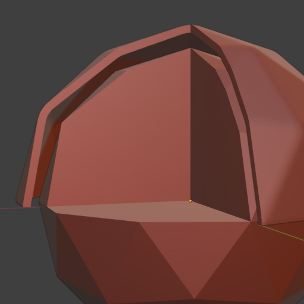

# Blender Shell Generator

A Blender add-on to generate shells with customizable offset and thickness for selected mesh objects, perfect for creating cases, enclosures, or molds.

  
*Result of the Shell Generator addon: A shell with offset from the object (cut for better visibility)*.

## Features

- Create precise offset shells around any mesh object
- Control shell thickness and offset distance
- Option to create open-bottom shells (cut at Z=0)
- Fast mode for open or self-intersecting meshes
- Ability to combine multiple selected objects to create a single shell
- Compatible with the 3D Print Toolbox
- User-friendly sidebar panel with intuitive controls
- Advanced options for customization
- Asynchronous processing with visual feedback
- Proper handling of Blender's unit settings

## Installation

1. Download the latest `blender_shell_generator-x.y.z.zip` from the [Releases](https://github.com/ruakij/blender-shell-generator/releases) page
2. In Blender, open **Edit → Preferences → Add-ons**
3. Click **Install from Disk…** and select the downloaded ZIP
4. Enable the **Shell Generator** add-on by ticking its checkbox

> Requires Blender 4.5 or newer.

## Usage

1. Select a mesh object in Object Mode
2. Access the Shell Generator through:
   - Sidebar panel: View3D > Sidebar > ShellGen
   - Object menu: Object > Shell Generator
   - Shortcut: Ctrl+Alt+S
3. Set Offset and Thickness
4. Click "Create Shell" to generate the shell

## Parameters

### Basic Settings
- **Offset**: Gap between original object and shell
- **Thickness**: Shell wall thickness
- **Open Bottom**: Remove geometry below Z=0

### Advanced
Collapsed by default; the defaults suit most meshes.
- **Combine Selected**: Join all selected meshes into one remeshed source for the shell
- **Even Thickness**: Help maintain thickness at sharp corners (experimental, may create artifacts)
- **Fast Mode**: Cut the cavity of an open or self-intersecting mesh with the faster but less reliable Float boolean solver instead of Exact
- **Auto Voxel Size**: Calculate the remesh resolution from the object size
  - **Detail Level**: Scale the automatic voxel size (lower = finer)
  - **Remesh Voxel Size**: Direct control over the remesh resolution when Auto Voxel Size is off

All lengths follow the scene unit settings. The defaults (10 offset, 5 thickness) are in Blender Units, which matches millimetres for STL files imported at scale 1.

### Add-on Preferences
- **Max Voxels per Axis**: Upper limit for the remesh resolution (default 250). Time and memory of the boolean cuts on the remeshed result grow with the square of this value; voxel sizes finer than the limit allows are raised automatically

## Known Issues

- Very complex meshes may require more processing time or even run Blender out of memory
   - Consider using lower resolution meshes or simplifying geometry to improve performance
   - "Fast Mode" and a coarser voxel size under Advanced also help
- The cavity is cut with the fast Manifold boolean solver only if the original mesh is closed and free of self-intersections; otherwise the much slower and more memory hungry Exact solver is used
    - For best results, ensure input meshes are clean and manifold
    - Alternatively, "Combine Selected" builds a clean remeshed source internally (also works for single meshes)
- At sharp corners, the shell offset and/or thickness may be smaller than requested.
    - Enabling "Even Thickness" can help maintain minimum thickness, but may introduce artifacts, especially in complex geometry.

## Development

The addon uses a modular structure for better maintainability:
- `__init__.py`: Addon registration and metadata
- `modules/core.py`: Core shell generation functionality
- `modules/operators.py`: Modal operator for shell creation
- `modules/properties.py`: Property definitions and preferences
- `modules/ui.py`: User interface with section organization
- `modules/utils.py`: Utility functions

## License

This project is licensed under the GPLv3 License - see the LICENSE file for details.
