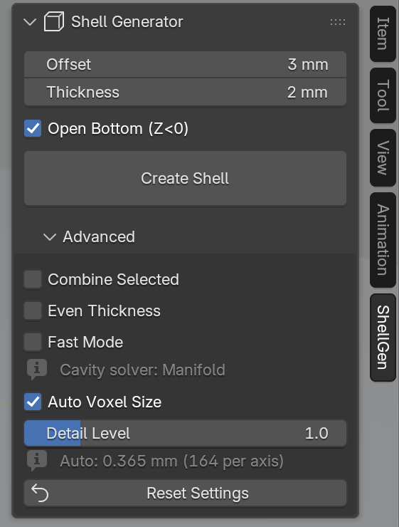

# Blender Shell Generator

A Blender add-on to generate shells with customizable offset and thickness for selected mesh objects, perfect for creating cases, enclosures, or molds.

  
*Result of the Shell Generator addon: A shell with offset from the object (cut for better visibility)*.

## Features

- Create precise offset shells around any mesh object
- Control shell thickness and offset distance
- Option to create open-bottom shells (cut at Z=0)
- Fast mode for open or self-intersecting meshes
- Ability to combine multiple selected objects to create a single shell
- Compatible with the 3D Print Toolbox
- User-friendly sidebar panel with intuitive controls
- Advanced options for customization
- Asynchronous processing with visual feedback
- Proper handling of Blender's unit settings

## Installation

1. Download the latest `blender_shell_generator-x.y.z.zip` from the [Releases](https://github.com/ruakij/blender-shell-generator/releases) page
2. In Blender, open **Edit → Preferences → Add-ons**
3. Click **Install from Disk…** and select the downloaded ZIP
4. Enable the **Shell Generator** add-on by ticking its checkbox

> Requires Blender 4.5 or newer.

## Usage

1. Select a mesh object in Object Mode
2. Access the Shell Generator through:
   - Sidebar panel: View3D > Sidebar > ShellGen
   - Object menu: Object > Shell Generator
   - Shortcut: Ctrl+Alt+S
3. Set Offset and Thickness
4. Check the warnings above the "Create Shell" button, if any
5. Click "Create Shell" to generate the shell. If the warnings include errors, a dialog lists them first, also when run from the menu or the shortcut

 
*The sidebar panel with the Advanced settings expanded*.

The shell is built from the meshes as the viewport shows them, with modifiers and shape keys applied. Mold and shell come without modifiers, shape keys or parent. Only one run can be active at a time; a failed run removes everything it created.

### Warnings
Warnings appear above the "Create Shell" button when something may give a poor or slow result, marked as an error when the result would be broken, lose geometry or cost a lot of time and memory, and as a note when it only looks unintended or may lower the quality. Only errors open the confirmation dialog:
- an open mesh (non-manifold edges) or a self-intersecting mesh, which need the slower Exact solver (or Float with Fast Mode); "Combine Selected" avoids both
- a voxel size above half the offset, for example when Max Voxels per Axis forces it on a large object with a small offset
- an object starting above Z=0 with Open Bottom on: the cut does not reach the cavity, which stays closed at the bottom
- an object entirely below Z=0 with Open Bottom on: the cut leaves little or nothing
- normals pointing inward (a closed mesh with negative volume): the offset then goes inward and the cavity cut fails; recalculating the normals fixes it
- offset plus thickness larger than the object, or the default offset and thickness in a scene with a unit scale other than 1: the sizes likely do not fit the scene
- more than one mesh selected while "Combine Selected" is off: only the active object is used
- with "Combine Selected": selected objects that are not meshes, which are ignored; an active object that is not selected, which is not part of the shell; and meshes lying far apart (together more than three times the size of the largest one), which coarsens the voxel size
- a mesh above one million faces, where the run takes long and needs several GB of memory

The checks for holes, self-intersections and inward normals read every face. The panel runs them at once for meshes up to 10,000 faces and, for meshes up to 100,000 faces, shortly after the selection, the object or its mesh stop changing. Larger meshes and meshes with enabled modifiers are checked only by "Create Shell", which lists their warnings in the dialog; the panel notes that more warnings may appear then.

"Create Shell" stays disabled while no mesh is selected (the active object alone does not count) or the mesh has no faces.

## Parameters

### Basic Settings
- **Offset**: Gap between original object and shell
- **Thickness**: Shell wall thickness
- **Open Bottom**: Remove geometry below Z=0

### Advanced
Collapsed by default; the defaults suit most meshes. "Reset Settings" at its bottom restores all settings.
- **Combine Selected**: Join all selected meshes into one remeshed source for the shell
- **Even Thickness**: Help maintain thickness at sharp corners (experimental, may create artifacts)
- **Fast Mode**: Cut the cavity of an open or self-intersecting mesh with the faster but less reliable Float boolean solver instead of Exact. The line below it shows the solver the cavity cut uses, hidden for a large mesh until Create checks it
- **Auto Voxel Size**: Calculate the remesh resolution from the object size and complexity, at most half the offset. The remesh only rebuilds the offset layer and lands within about one voxel, so this keeps at least half the requested gap. The line below it shows the resulting voxel size and the voxels along the longest axis
  - **Detail Level**: Scale the size-based voxel size (lower = finer)
  - **Remesh Voxel Size**: Direct control over the remesh resolution when Auto Voxel Size is off; a line shows the size actually used when Max Voxels per Axis raises it

All lengths follow the scene unit settings. The defaults (10 offset, 5 thickness) are in Blender Units, which matches millimetres for STL files imported at scale 1.

### Add-on Preferences
- **Max Voxels per Axis**: Upper limit for the remesh resolution (default 250). Time and memory of the boolean cuts on the remeshed result grow with the square of this value; voxel sizes finer than the limit allows are raised automatically

## Known Issues

- Very complex meshes may require more processing time or even run Blender out of memory
   - Consider using lower resolution meshes or simplifying geometry to improve performance
   - "Fast Mode" and a coarser voxel size under Advanced also help
- The cavity is cut with the fast Manifold boolean solver only if the original mesh is closed and free of self-intersections; otherwise the much slower and more memory hungry Exact solver is used
    - For best results, ensure input meshes are clean and manifold
    - Alternatively, "Combine Selected" builds a clean remeshed source internally (also works for single meshes)
- At sharp corners, the shell offset and/or thickness may be smaller than requested.
    - Enabling "Even Thickness" can help maintain minimum thickness, but may introduce artifacts, especially in complex geometry.
- A thick shell around a concave object can fill or bridge the concave parts; no check warns about it
- The open bottom always cuts at Z=0 of the world

## Development

The addon uses a modular structure for better maintainability:
- `__init__.py`: Addon registration and metadata
- `modules/core.py`: Core shell generation functionality
- `modules/operators.py`: Modal operator for shell creation
- `modules/properties.py`: Property definitions and preferences
- `modules/ui.py`: User interface with section organization
- `modules/utils.py`: Utility functions

## License

This project is licensed under the GPLv3 License - see the LICENSE file for details.
